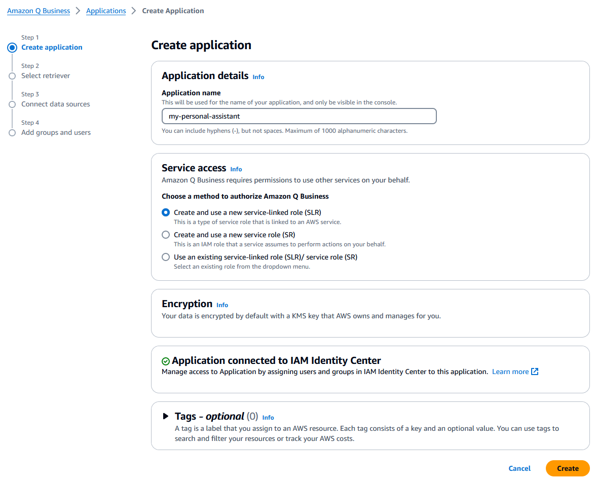
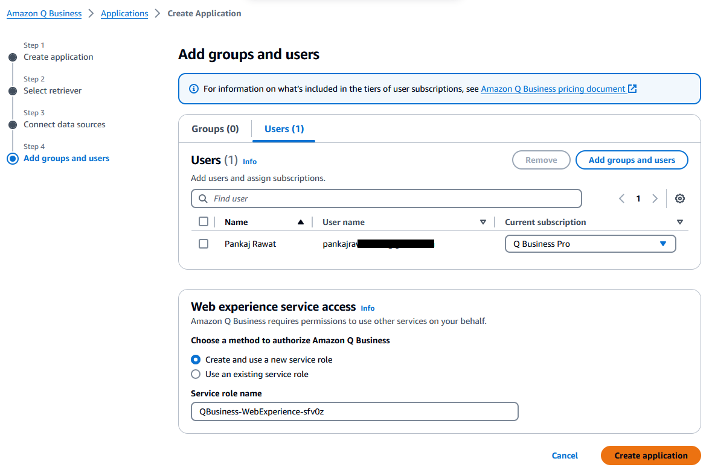
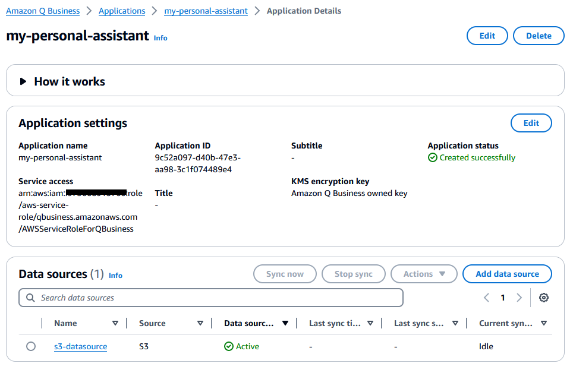

Title: Building Serverless Conversational Gen AI Application using Amazon Q Business

Description: We will use Amazon Q Business to build conversational generative AI application without writing any code.
Published: 24/06/2024
Image: /posts/images/amazon-q-business-gen-ai-app/amazon-q-app.jpeg
Tags:
  - aws
  - genai
  - amazon-q
  - amazon-q-business
  - textract
  - bedrock
  - lambda
  - s3
---

[Amazon Q Business](https://docs.aws.amazon.com/amazonq/latest/qbusiness-ug/what-is.html) is a conversational assistant powered by generative artificial intelligence (AI) that enhances workforce productivity by answering questions on your data. Amazon Q Business also helps streamline tasks and accelerate problem solving. You can use Amazon Q Business to create and share task automation applications, or perform routine actions like submitting time-off requests and sending meeting invites.

In this blog post, you will learn how to develop conversational assistant using Amazon Q Business to access your private data without writing any code. You can develop a similar solution for enterprises with various enterprise data sources (Share point documents, application logs in S3 bucket, documents in google drive etc.)

[Connectors](https://docs.aws.amazon.com/amazonq/latest/qbusiness-ug/connectors-list.html) makes it easy to synchronize data from multiple content repositories with your Amazon Q index. Connectors can be scheduled to automatically sync your index with your data source, so you're always securely searching through the most up-to-date content.

For experimental purpose, I used my personal documents. I have uploaded my personal documents such as Aadhaar, PAN, Driving license, Voter ID, Bank Account Passbook, and many more scanned documents in Amazon S3 bucket. 
Handling documents in image format can be quite challenging, as they are not readily without the appropriate tools. This is where Optical Character Recognition (OCR) software comes into play. To address this issue, I utilized Amazon Textract for its robust data extraction capabilities. For those interested in exploring further, I have shared the complete source code along with an explanation on [ServerlessLand](https://serverlessland.com/patterns/textract-lambda-cdk-dotnet). 

However, the situation became more complex when I began uploading a diverse set of documents (labeled, unlabeled and multilingual). The initial result were unsatisfactory. Although Amazon Textract training improve the outcome, the time investment was more sigiificant than I had anticipated.

Here are the few reasons why I didn't use Textract:

-  My documents were too varied to standardize.
- Textract’s custom model training demanded sample documents that were tough to procure.
- Training time for each document was extensive, and for an experimental app, it was time I couldn’t justify.

To address the challenges mentioned, I utilized [Amazon Bedrock](https://aws.amazon.com/bedrock/), a fully managed service that offers access to foundational models (FMs) from premier AI organizations via a single interface. **Anthrophic’s Claude 3**, one of the models available on Amazon Bedrock, offers vision capabilities. I used Claude 3 Sonnet model to extract the text from the scanned documents. For those interested in exploring further, I have shared the complete source code along with an explanation on [ServerlessLand](https://serverlessland.com/patterns/bedrock-lambda-cdk-dotnet).

Once I have received my data in text format, I wanted to build conversational assistant top of my personal data.

## Solution overview

The following diagram shows a high-level architecture of how I used Amazon Q business application to build conversational assistant on personal documents. 

The following diagram illustrates the high-level architecture of how users will interact with the Amazon Q Business application using an Amazon Q Business web experience from their web browser. The Amazon Q Web Experience is secured by AWS IAM Identity Center. Users will upload scanned documents to an S3 bucket, and a Lambda function will extract text from the uploaded documents using Amazon Bedrock. The output of the extracted documents will be stored in an S3 bucket, which will serve as the source for the Amazon Q Business application.

**The solution includes the following components:**

1. Amazon S3 bucket - S3 bucket used as a datasource for Amazon Q Business.
2. AWS Lambda Function - Lambda function that extract text scanned documents using Amazon Bedrock.
3. Anthropic’s Claude 3 on Amazon Bedrock - Lambda function utilizes Anthropic's Claude 3 sonnat model to extract text from images.
4. Amazon Q business application - Build conversational assistant using Amazon Q business and Web experience.
5. AWS IAM Identity center - Amazon Q Web Experience is secured by AWS IAM Identity center.

## **Configure an Amazon Q Business application**

- Login to your AWS account and open Amazon Q Business
- Choose **Create application**
- For **Application name**, enter a name
- For **Service Access**, keep default option selected **Amazon Q Business requires permissions to use other services on your behalf**. (you can change option if required)
- Choose **Create**.

- On the **Select retriever** page, select **Use native retriever** unless you want to configure a preexisting [Amazon Kendra](https://aws.amazon.com/kendra/) index as a retriever, or you need to configure storage units for more
than 20,000 documents, you can continue with the default settings.

- keep default selection for **Index provisioning**
- Choose **Next**.
- On the **Connect data sources** page, for **add data source**, choose **Amazon S3**.

- Enter **Data source name**.
- For **IAM role**, select **Create a new service role (Recommended)**.

- For **Sync scope**, Browse S3 bucket and select appropriate bucket.
    - My data was stored in output folder, hence given include patterns “output/”
- For **Sync mode** select **full sync**.
- For **Sync run schedule**, Select **Run on demand** (you can change sync run schedule according to your data update frequency)

- Choose **Add data source**
- Choose **Next**
- On **Add groups and users** section, select **Users** tab and **Add or assign users and groups**.
- Choose **Add new users** and select **Next**

- Add user detail and choose **Next**.

- Again you need to click on **Add groups and users**
- Choose **Assign existing users**
- Choose **Assign**

- Choose **Create application**

- You will receive invitation on your email, Accept invitation and setup your account.

- On Web experience service access, keep default selection **Create and use a new service role**.
- Choose **Create application**.

Once application is created, you need to wait for S3 data to sync. In above steps we have selected manual sync.

- To sync data source manually, **Select application**

- On **Data source** section, Select **s3-datasource** and Choose **Sync now**

- Once sync is complete you are good to start conversation. You can check sync status on **Data Source** tab.

- To start conversation, go back on **application** (my-personal-assistant) and select **web experience**.
- Use your credential which you have created in above steps.
- Once you have logged in successfully, you can start asking question related to your document.

- Amazon Q Business will add **source** information on each response so you can check the source of the information if required.

### **Conclusion**

By using Amazon Q Business, you can build private conversational Generative AI assistant without writing any code. It has many connectors which help you to easily integrate with your existing data sources without moving the data. Amazon Q makes it easy to connect the data and start asking questions in natural language.
I used Amazon Bedrock over Textract for data extraction from scanned documents but It’s doesn’t mean Bedrock is better than Textract for data extraction. In fact, Amazon Textract is a machine learning (ML) service specifically designed to extracts text, handwriting, layout elements, and data from scanned documents. In most cases, Amazon Textract is well-suited for data extraction from scanned documents.

Happy cloud computing.